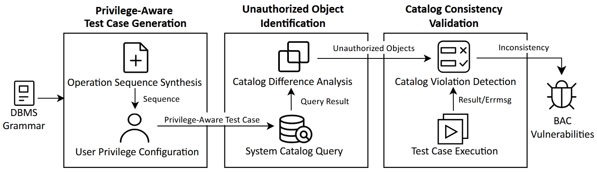

# Beacon: Detecting Broken Access Control Vulnerabilities in DBMSs via System Catalog Consistency Validation

**Beacon** aims to detect Broken Access Control (BAC) vulnerabilities by validating the consistency between SQL operations and system catalogs.

The key insight of Beacon is that the visibility of objects in the system catalog is consistent with the user's access control: if an object is invisible to a user in the system catalog, the user should not have any access privileges on that.



## How to Run Beacon

First, start the databases with Docker:
```bash
# MySQL
docker run -e MYSQL_ALLOW_EMPTY_PASSWORD=1 -p 3306:3306 -itd --name some-mysql mysql:9.2.0
# MariaDB
docker run -itd --name some-mariadb --env MARIADB_ALLOW_EMPTY_ROOT_PASSWORD=1 -p 3309:3306 mariadb:11.6.1-rc
# OceanBase
docker run -p 2881:2881 --name some-oceanbase -e MODE=slim -d oceanbase/oceanbase-ce:4.3.4.0-100000162024110717
# StarRocks
docker run -p 9030:9030 -p 8030:8030 -p 8040:8040 -itd --name some-starrocks starrocks/allin1-ubuntu:3.3.5
# TiDB
docker run -d --name some-tidb -p 4000:4000 -p 10080:10080 pingcap/tidb:v9.0.0-beta.1
# Dameng
docker run -d -p 30236:5236 --restart=always --name=some-dameng --privileged=true -e LD_LIBRARY_PATH=/opt/dmdbms/bin -e PAGE_SIZE=16 -e EXTENT_SIZE=32 -e LOG_SIZE=1024 -e UNICODE_FLAG=1  -e INSTANCE_NAME=dm8_test greyhawk/dm8_single:dm8_20241022_rev244896_x86_rh6_64
# MonetDB
docker run -e MDB_DB_ADMIN_PASS=monetdb --name some-monetdb -p 50000:50000 -itd monetdb/monetdb:Mar2025-SP1
# PostgreSQL
docker run --name some-postgres -e POSTGRES_PASSWORD='' -e POSTGRES_HOST_AUTH_METHOD=trust -p 5432:5432 -d postgres:18.1

# Wait for the database Docker containers to be ready
sleep 30
```

Second, install python 3.10.x and run `pip install -r src/requirements.txt`.

Third, execute main.py with the `--dbms` argument. Available argument values include `mysql,mariadb,oceanbase,starrocks,tidb,dameng,monetdb`:
```bash
cd src/
python3 main.py --dbms mysql       # Test MySQL
python3 main.py --dbms mariadb     # Test MariaDB
python3 main.py --dbms oceanbase   # Test OceanBase
python3 main.py --dbms starrocks   # Test StarRocks
python3 main.py --dbms tidb        # Test TiDB
python3 main.py --dbms dameng      # Test Dameng
python3 main.py --dbms monetdb     # Test MonetDB
python3 main.py --dbms postgresql  # Test PostgreSQL
```

The tool will continuously test the target DBMS and output the testing status. If an ERROR level log occurs in the result, it means that Beacon detects a potential BAC vulnerability. You can set `--log-level` to `ERROR` to only output the ERROR level logs.

## BAC Vulnerability List

The following table summarizes the BAC vulnerabilities detected by Beacon in various DBMSs:

| DBMS       | Command | Rule         | Bug Count and Status           |
|------------|---------|--------------|--------------------------------|
| MySQL      | SELECT           | Rule_result  | Confirmed (4)                  |
| MySQL      | SHOW             | Rule_result  | Confirmed (1)                  |
| MariaDB    | DROP TRIGGER     | Rule_errmsg  | Confirmed (1)                  |
| MariaDB    | LOAD CACHE       | Rule_cmd     | Confirmed (1)                  |
| MariaDB    | SELECT           | Rule_result  | Confirmed & Fixed (3)          |
| OceanBase  | CALL             | Rule_cmd     | Confirmed (2)                  |
| OceanBase  | CREATE TRIGGER   | Rule_cmd     | Confirmed & Fixed (1)          |
| OceanBase  | CREATE PROCEDURE | Rule_cmd     | Confirmed & Fixed (1)          |
| OceanBase  | CREATE FUNCTION  | Rule_cmd     | Confirmed & Fixed (1)          |
| OceanBase  | SELECT           | Rule_result  | Confirmed & Fixed (3)          |
| OceanBase  | SHOW             | Rule_result  | Confirmed & Fixed (2)          |
| StarRocks  | INSERT INTO      | Rule_errmsg  | Confirmed & Fixed (1)          |
| StarRocks  | SHOW             | Rule_result  | Confirmed & Fixed (2)          |
| TiDB       | DELETE           | Rule_cmd     | Confirmed (2)                  |
| TiDB       | ADMIN            | Rule_cmd     | Confirmed & Fixed (4)          |
| TiDB       | REPLACE VIEW     | Rule_cmd     | Confirmed & Fixed (1)          |
| TiDB       | SELECT FOR UPDATE| Rule_cmd     | Confirmed & Fixed (1)          |
| Dameng     | CREATE SCHEMA    | Rule_cmd     | Confirmed (1)                  |
| Dameng     | SELECT           | Rule_result  | Confirmed (3)                  |
| MonetDB    | ALTER USER       | Rule_cmd     | Confirmed & Fixed (2)          |
| MonetDB    | DROP USER        | Rule_cmd     | Confirmed & Fixed (1)          |
| PostgreSQL | CREATE TYPE      | Rule_cmd     | Confirmed (1)                  |

## How to Use PoC
The PoCs for each bug are provided in the `poc` directory.

Before reproducing each vulnerability, you should follow these steps to set up the test environment:
1. Login with the root user.
2. Execute the following commands:
    ```
    DROP DATABASE IF EXISTS test;
    CREATE DATABASE test;
    USE test;
    DROP USER IF EXISTS regular_user;
    CREATE USER regular_user;
    ```